# 📊 Excel Function Practice – Sales Dataset

This project demonstrates the use of **common Excel functions** on a real-world sales dataset.

---

## 📁 Dataset Description

- Fields: `Invoice`, `StockCode`, `Description`, `Quantity`, `Price`, `Customer`, `Country`, `InvoiceDate`
- Data covers the years 2010–2011
- Example countries: United Kingdom, France

---

## ✅ Functions Covered

| Function        | Description |
|-----------------|-------------|
| `COUNTA`        | Count non-empty cells |
| `COUNTIF`       | Count cells by condition |
| `COUNTIFS`      | Count with multiple conditions |
| `TRIM`          | Remove extra spaces from text |
| `CONCATENATE`   | Merge text strings |
| `LEFT`, `RIGHT` | Extract characters from strings |
| `WEEKDAY`       | Return the day of the week |

## 🔍 Formula Examples and Results

excel
=COUNTA(A:A)

Counts all non-empty cells in the Invoice column.
📷 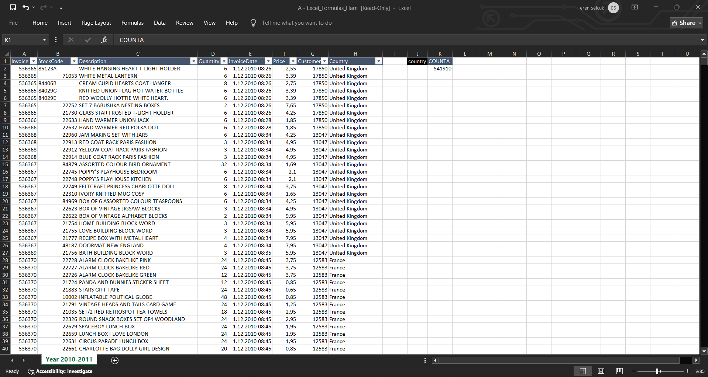

=COUNTIF(H:H, "France") Counts how many rows have Country = France.

📷 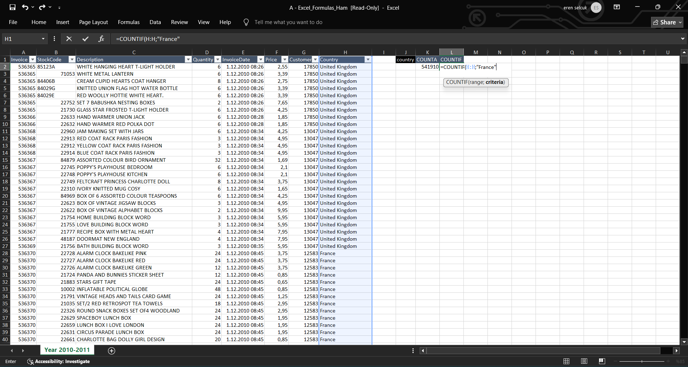  
📷 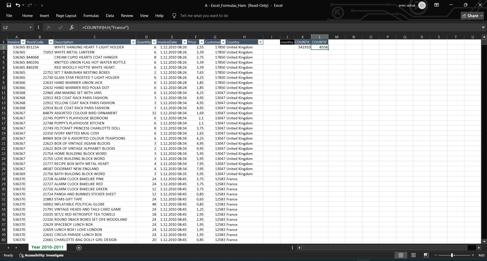 

=COUNTIF(D:D, ">10") Counts how many rows have Quantity > 10.

📷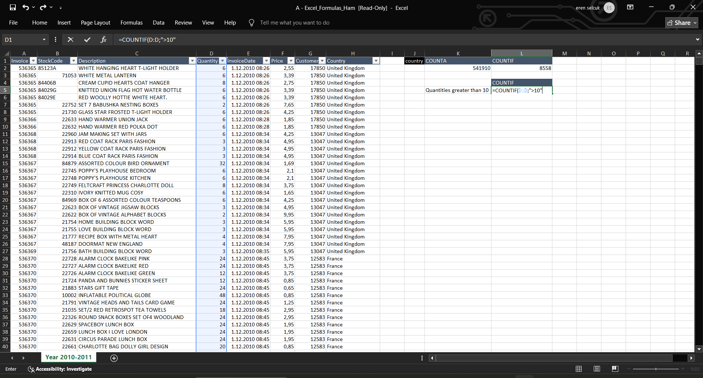  

=COUNTIFS(H:H, "France", D:D, ">10") Counts rows where:

Country is France

Quantity is greater than 10

📷 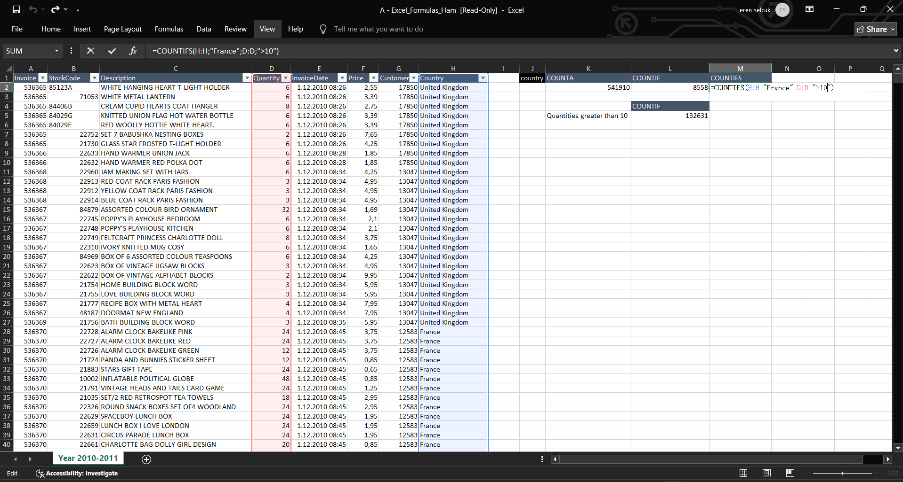  

=TRIM(" blank ") Removes leading and trailing spaces. Returns: blank

📷 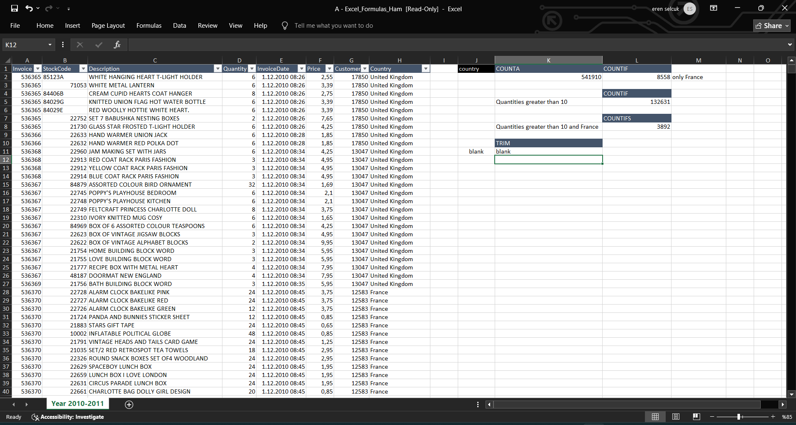  

=CONCATENATE("FRANK", "JOHN", "JESSIE") Returns: FRANKJOHNJESSIE

📷 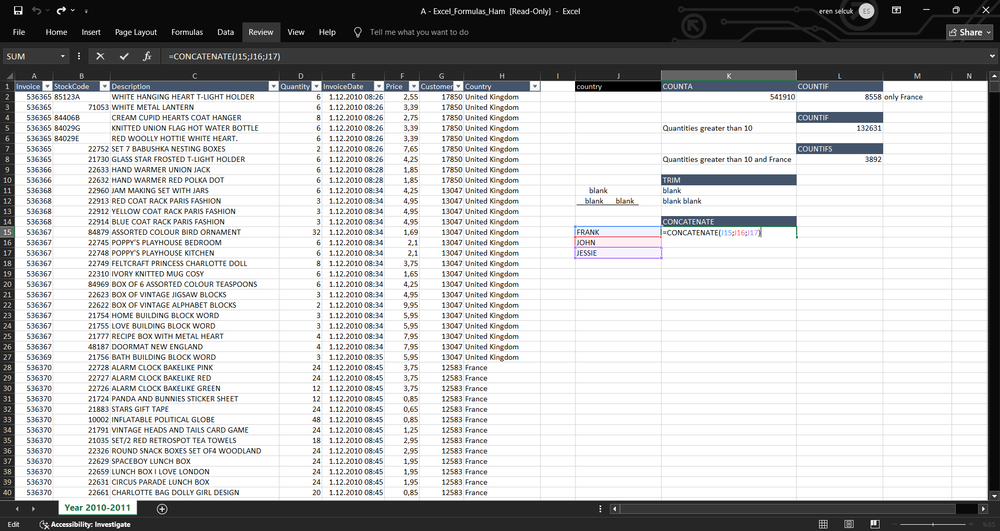  
[CONCATENATE v2](screenshots/concat2.png)

=LEFT(J19, 3) =RIGHT(J20, 5) =RIGHT(LEFT(J24, 11), 2) Extracts specific portions of a string.

📷 Screenshots:

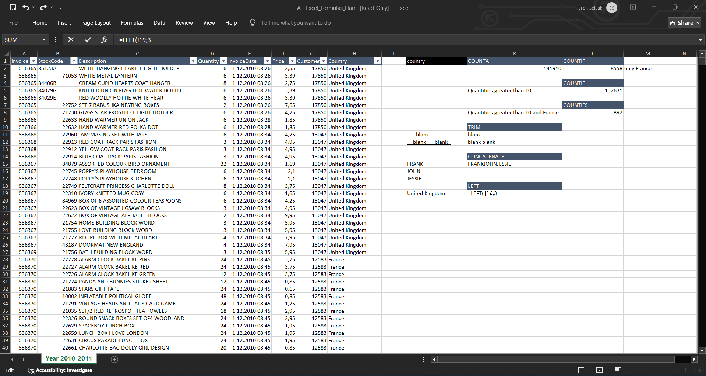  

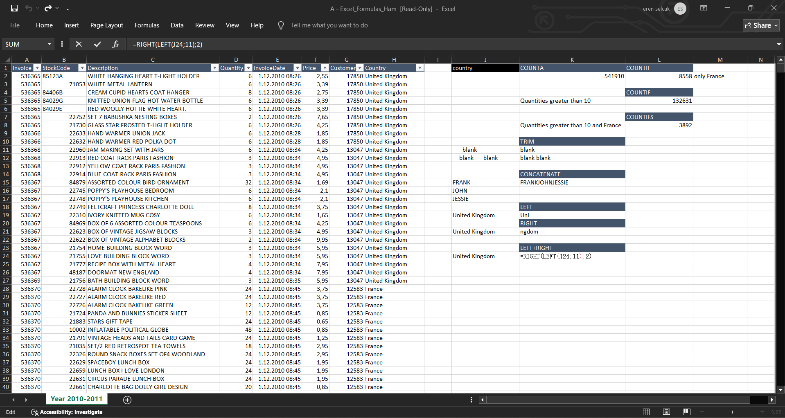  

=WEEKDAY(J27, 11) Returns numeric value for weekday (e.g., 3 = Thursday).

📷 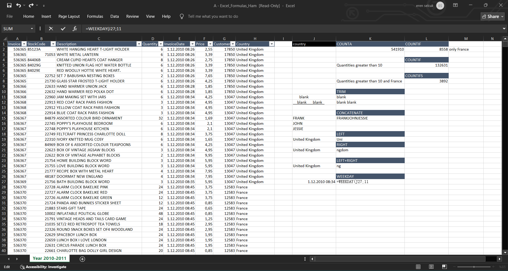
📷 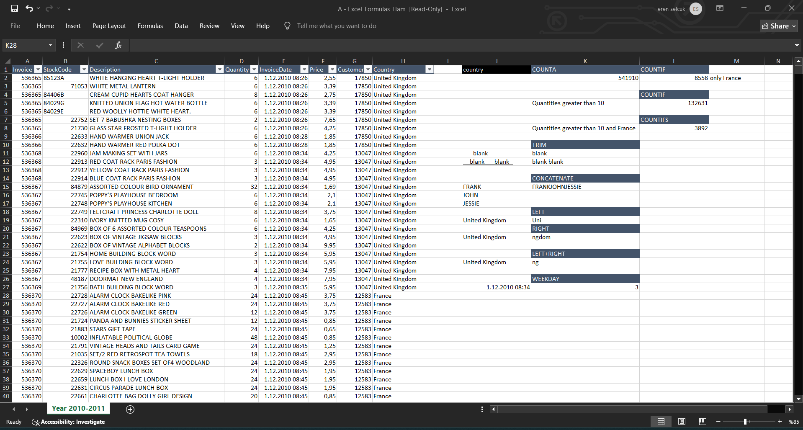

=EXACT(I32, J32) Returns TRUE only if both strings are exactly the same (case-sensitive).

📷 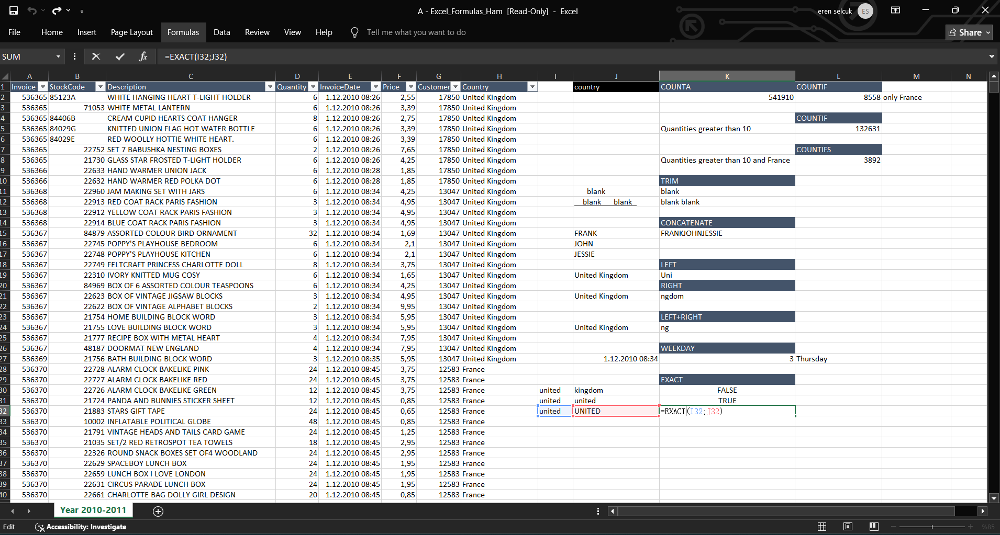 
📷 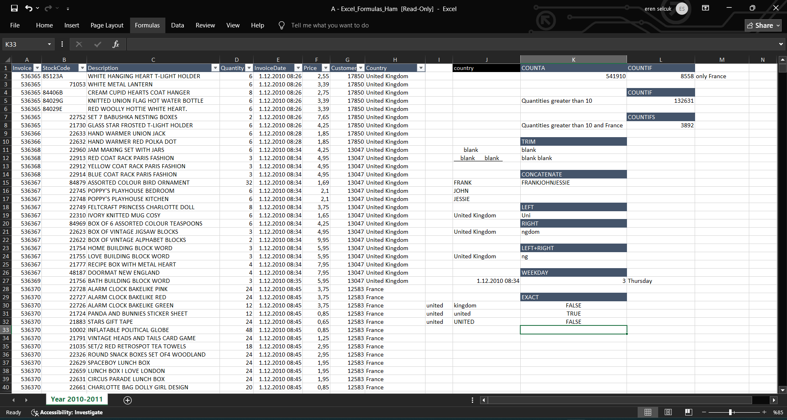 
=I32=J32 Returns TRUE even if case is different, as long as content matches.

📷 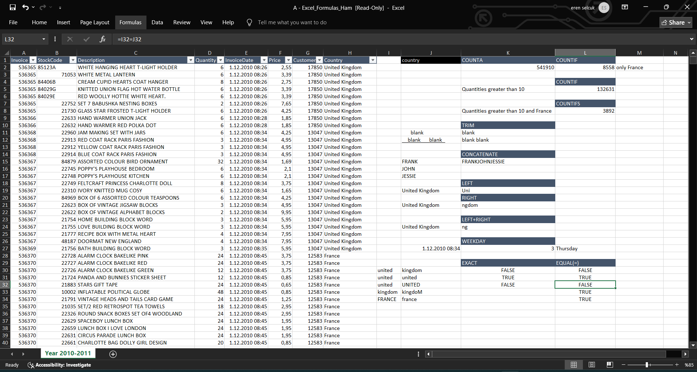 

=SUMIF(H:H, "France", D:D) Sums all Quantity values where Country = France.

📷 Screenshots:

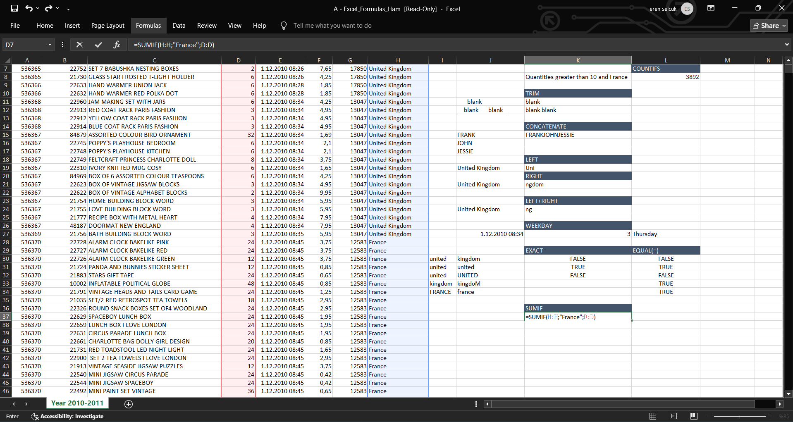  

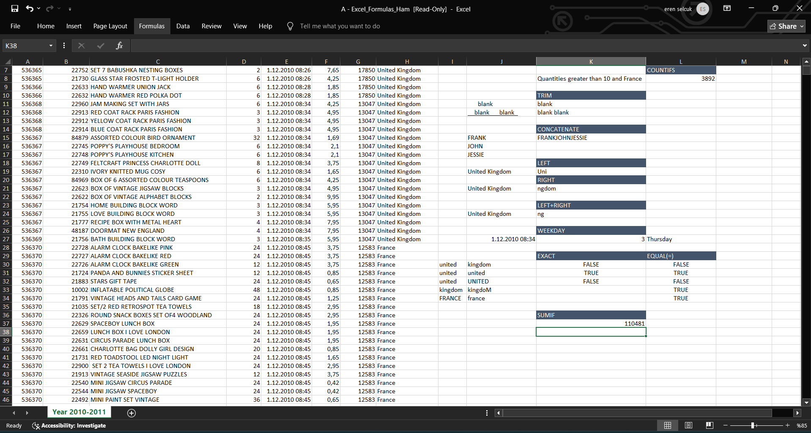  

=SUMIFS(D:D, H:H, "France", F:F, ">5") Sums quantities where:

Country is France

Price is greater than 5

📷 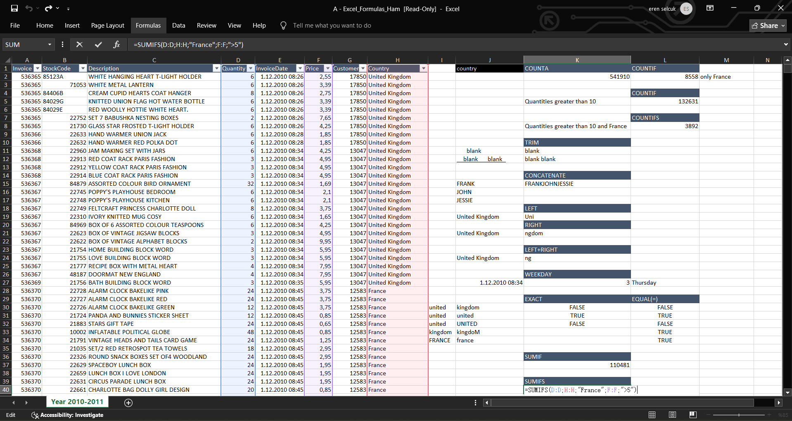
| `EXACT`, `=`    | Text comparisons (case-sensitive / insensitive) |
| `SUMIF`         | Sum based on one condition |
| `SUMIFS`        | Sum based on multiple conditions |

---

